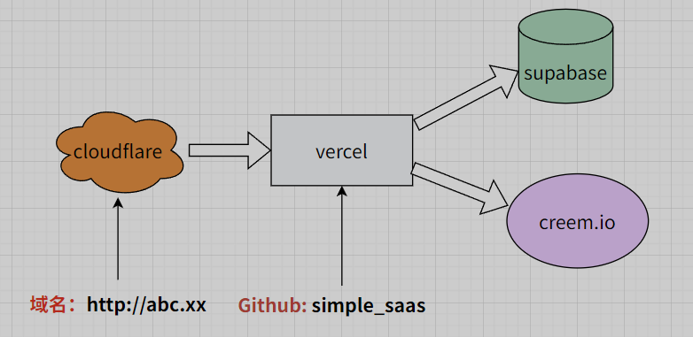

# Simple Saas Starter Kit

全网最极简的SAAS网站模板！
帮助开发者快速搭建支持全球用户登录和支付的网站系统。

基于raphael-starterkit-v1做了简化重构，面向小白的启动套件，进一步降低学习成本。
功能仅包括登录（用户管理）、支付，没了。

别对中国大陆开发者友好。


## 🌟 简介

基于 Next.js、Supabase 和 Creem.io 生产就绪的启动套件
快速构建具有身份验证、订阅和积分系统的 SaaS 应用程序。


## 核心特色功能

- 🔐 **全面的身份验证系统**
  - 基于Supabase
  - 电子邮件登录支持
  - Google 登录支持

- 💳 **完整的支付与订阅系统**
  - 与Creem.io集成，支持全球信用卡收款，支持支付宝

- 📱 **响应式设计**


## 快速开始



### 前提条件

- Node.js 18+ 和 npm
- Supabase 账户
- Creem.io 账户

### 步骤 1: 克隆仓库

```bash
git clone https://github.com/fishfl/simple_saas.git
cd simple_saas
```

@@@

强烈建议，先fork代码到自己的仓库里，再执行clone。毕竟你后续还要完善你自己的业务代码。
直接clone这个代码库仅用作演示。

@@@


### 步骤 2: 安装依赖

```bash
npm i
```

### 步骤 3: 开启环境变量
   ```bash
   cp .env.example .env.local
   ```


### 步骤 4: 设置 Supabase

1. 在 [Supabase](https://app.supabase.com) 上创建一个新项目
   - 点击"新建项目"
   - 填写基本信息（项目名称、密码等）

2. Settings > Data API
   - 复制API URL, 粘贴到.env文件中NEXT_PUBLIC_SUPABASE_URL

   同样，Settings > API Keys 
   Legacy anon, service_role API keys
   - 复制anon public 粘贴到NEXT_PUBLIC_SUPABASE_ANON_KEY
   - 复制service_role 粘贴到SUPABASE_SERVICE_ROLE_KEY

3. 配置登录方式
   - 选择【Authentication】>【Sign In / Providers】
   - 开启email登录、开启谷歌登录

4. *设置Google登录
   - 进入[Google 开发者控制台](https://console.cloud.google.com)，创建新项目
   - 配置项目权限
   - 前往【API与服务】>【凭据】
   - 创建OAuth客户端ID（可能要先创建品牌塑造）
   - 添加授权来源URL和重定向URI
   - 重定向URI格式: `https://<项目ID>.supabase.co/auth/v1/callback`
     （注意是id不是name，在Supabase项目setting页面复制）
   - 复制OAuth客户端ID和密钥

   回到Supabase配置Google登录
   - 选择【Authentication】>【Sign In / Providers】
   - 点击Google登录
   - 填写从Google开发者控制台获取的客户端ID和密钥

5. 创建数据库表结构
   - 打开supabase/migrations/20250101000000_init_schema.sql
   - 复制SQL代码到Supabase SQL编辑器
   - 执行SQL创建表结构


### 步骤 5: 设置 Creem.io

1. 登录到 [Creem.io 仪表板](https://www.creem.io/)
2. 初始设置
   - 创建一个商店，填写各种基本信息
   - 打开测试mode
   - Developers > API & Webhooks
   - 复制API Key并粘贴到.env文件中CREEM_API_KEY

3. 创建Webhooks
   - Developers > API & Webhooks
   - 创建新的Webhook
   - 填写URL: `https://你的域名/api/webhooks/creem`
   - 复制Webhook密钥并粘贴到.env文件中CREEM_WEBHOOK_SECRET
   这时，你可能还没有域名，没关系，随便填一个，我们稍后回来再改


4. 测试API地址和生产地址
   我们前期都在测试模式，所以这个地址不用改
   ```
   CREEM_API_URL=https://test-api.creem.io/v1
   ```

5. 创建收费Product
   
   - 在在Products里创建两个产品，一个订阅项目和一个积分项目
   - 复制产品ID并配置到代码config/subscriptions.ts中，订阅项目先用同一个id，积分项目先用另一个id


### 步骤 6: 运行开发服务器

```bash
npm run dev
```

访问 [http://localhost:3000](http://localhost:3000) 查看你的应用程序。


```
恭喜，整个开发环境已经跑起来了！！！

接下来我们开始部署到线上！
```


现在，可以去买个自己域名了，或者用Vercel生成的子域名，下面不再提示，都称‘你的域名’
（Vercel生成的子域名访问性不佳，国内有时需要梯子才能访问到）


### 步骤 7: Vercel部署

1. 将代码推送到GitHub
2. 将仓库导入到[Vercel](https://vercel.com)
3. 添加导入所有环境变量
4. 完成部署
5. 修改环境变量BASE_URL、CREEM_SUCCESS_URL，指向你的域名

### 步骤 8: 更新Webhook回调地址

1. 进入Creem.io，进入开发者模式
2. 更新Webhooks配置
   - Developers > API & Webhooks
   - 将URL更新为: `https://你的域名/api/webhooks/creem`


### 步骤 9: 更新Supabase回调地址
1. 进入Supabase，Authentication > URL Configuration
2. 更新Site URL为：`https://你的域名/`


### 后续步骤：

1. 测试用户登录功能
2. 测试订阅支付、积分购买功能（测试信用卡号: 4242 4242 4242 4242）
3. 切换Creem.io到正式付款，更新环境变量
   ```
   CREEM_TEST_MODE=false
   CREEM_API_URL=https://api.creem.io
   ```

   


## 项目结构

```
├── app/                   # Next.js 应用目录 (App Router)
│   ├── (auth-pages)/     # 身份验证相关页面 (登录/注册)
│   ├── api/             # API 路由 (支付回调/积分接口等)
│   ├── dashboard/        # 用户仪表板页面
│   ├── auth/            # Auth 回调处理
│   ├── globals.css      # 全局样式文件
│   ├── layout.tsx       # 根布局文件
│   └── page.tsx         # 落地页 (Landing Page)
├── components/           # React 组件
│   ├── dashboard/      # 仪表板业务组件
│   ├── ui/             # Shadcn/ui 通用组件库
│   ├── header.tsx      # 顶部导航栏
│   └── ...             # 其他共享组件
├── config/              # 配置文件 (订阅计划/积分套餐)
├── hooks/               # 自定义 React Hooks (use-user, use-toast)
├── lib/                # 第三方库配置 (utils)
├── public/             # 静态资源 (图片/图标)
├── supabase/           # Supabase 迁移脚本和类型
├── types/              # TypeScript 类型定义
└── utils/              # 工具函数和中间件辅助
```
